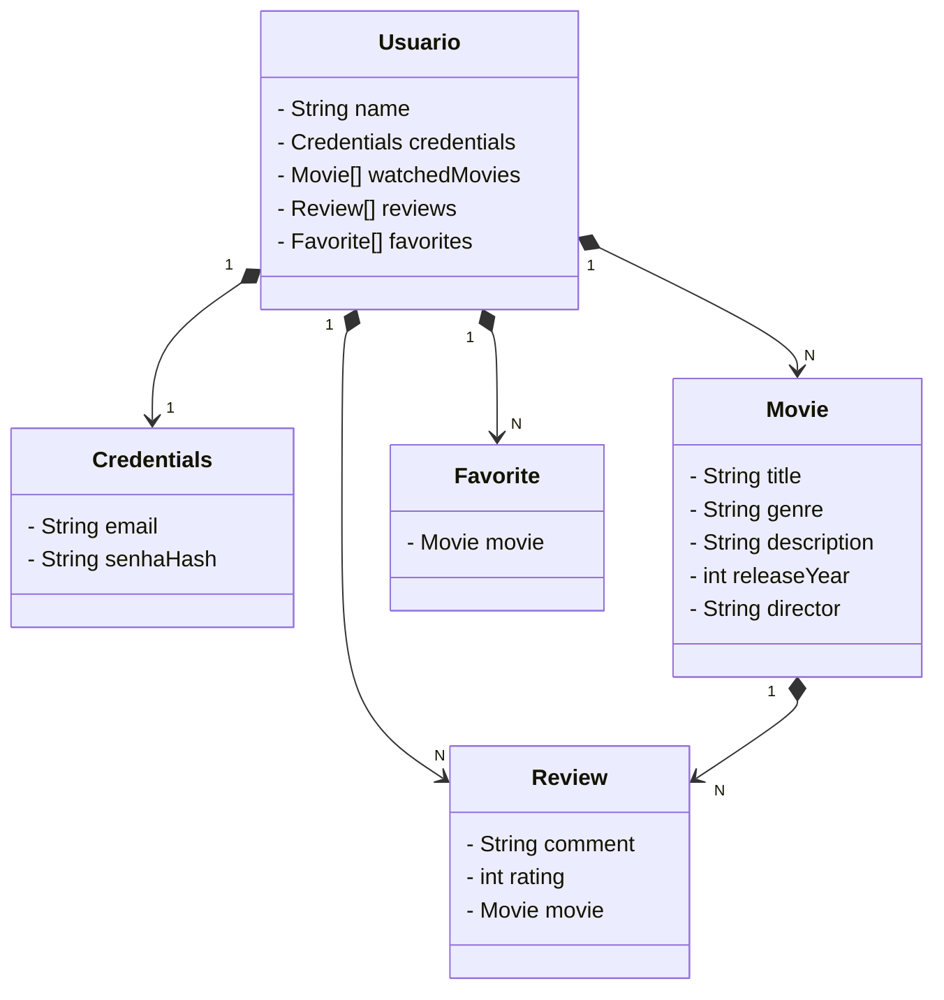

# Aplicacao Spring Boot - Sistema de Filmes

Este projeto foi desenvolvido como parte do **Bootcamp da Avanade** e visa fornecer uma plataforma onde os usuários podem registrar filmes assistidos, fazer críticas e manter uma lista de favoritos. A aplicação foi construída utilizando o **Spring Boot** e inclui **autenticação JWT** para segurança.

## Funcionalidades

- **Autenticação JWT**: O sistema implementa autenticação segura através de tokens JWT, garantindo que apenas usuários autenticados possam acessar as funcionalidades.
- **Filmes**: Os usuários podem visualizar e interagir com filmes, com atributos como título, gênero, descrição, ano de lançamento e diretor.
- **Críticas**: Os usuários podem fazer críticas aos filmes com comentários e uma nota
- **Favoritos**: O sistema permite que os usuários adicionem filmes à sua lista de favoritos.

## Tecnologias Utilizadas

- **Spring Boot**: Framework para desenvolvimento de aplicações Java.
- **JWT (JSON Web Token)**: Implementação de autenticação e autorização baseada em tokens JWT.
- **JPA (Java Persistence API)**: Para persistência de dados no banco de dados.
- **H2 Database**: Banco de dados embutido para armazenamento dos dados da aplicação.

## Diagrama de Classes

O diagrama a seguir descreve as entidades principais e seus relacionamentos:



---

## Endpoints da API

### **Autenticação**

- **Registrar um novo usuário**
  - `POST /auth/register`
  - **Body:**
    ```json
    {
        
        "email": "joao@email.com",
        "password": "123456",
        "role": "ADMIN",
        "name": "João Silva",
    
    }
    ```

- **Login e geração de JWT**
  - `POST /auth/login`
  - **Body:**
    ```json
    {
        "email": "joao@email.com",
        "password": "123456"
    }
    ```

---

### **Filmes**

- **Listar todos os filmes**
  - `GET /movie`

- **Buscar um filme pelo ID**
  - `GET /movie/{id}`
- **Buscar um filme pelo Title**
  - `GET /movie/title/{title}`

- **Criar um novo filme**
  
  - `POST /movie`
  - **Body:**
    ```json
    {
        "title": "Inception",
        "genre": "Sci-Fi",
        "description": "Um ladrão invade os sonhos das pessoas para roubar segredos.",
        "releaseYear": 2010,
        "director": "Christopher Nolan"
    }
    ```
    Apenas ADMIN podem adicionar filmes

---

### **Filmes Assistidos**

- **Adicionar um filme aos assistidos do usuário**
  - `POST /users/{userId}/watched/{movieId}`  

- **Listar os filmes assistidos de um usuário**
  - `GET /users/{userId}/watched`
---

### **Críticas**

- **Adicionar uma crítica a um filme**
  - `POST /reviews`
  - **Body:**
    ```json
    {
        "userId: 1,
        "movieId": 1,
        "content": "Filme incrível!",
        "rating": 5
    }
    ```
---

### **Favoritos**

- **Adicionar um filme aos favoritos do usuário**
  - `POST /favorites/add`
  - **Body:**
    ```json
    {
        "userId":1,
        "movieId": 1
    }
    ```
---


## Autor
Projeto desenvolvido por Arthur Marcelino ((https://github.com/Arthurecomp/)) como parte do **Bootcamp Avanade** 🚀

