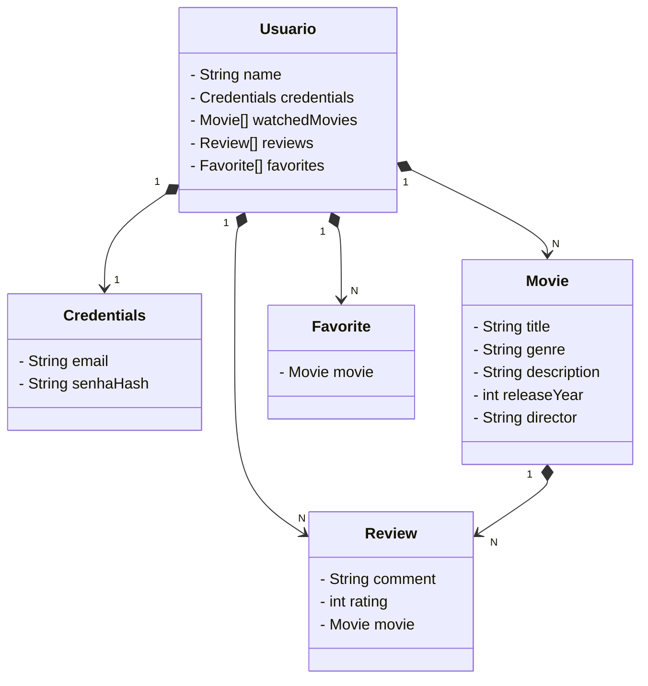

# Aplicação Spring Boot - Sistema de Filmes

Este projeto foi desenvolvido como parte do **Bootcamp da Avanade** e visa fornecer uma plataforma onde os usuários podem registrar filmes assistidos, fazer críticas e manter uma lista de favoritos. A aplicação foi construída utilizando o **Spring Boot** e inclui **autenticação JWT** para segurança.

## Funcionalidades

- **Autenticação JWT**: O sistema implementa autenticação segura através de tokens JWT, garantindo que apenas usuários autenticados possam acessar as funcionalidades.
- **Filmes**: Os usuários podem visualizar e interagir com filmes, com atributos como título, gênero, descrição, ano de lançamento e diretor.
- **Críticas**: Os usuários podem fazer críticas aos filmes com comentários e uma classificação de 1 a 5 estrelas.
- **Favoritos**: O sistema permite que os usuários adicionem filmes à sua lista de favoritos.

## Diagrama de Classes

O diagrama a seguir descreve as entidades principais e seus relacionamentos:

## Tecnologias Utilizadas
- Spring Boot: Framework para desenvolvimento de aplicações Java.
- JWT (JSON Web Token): Implementação de autenticação e autorização baseada em tokens JWT.
- JPA (Java Persistence API): Para persistência de dados no banco de dados.
- H2 Database: Banco de dados embutido para armazenamento dos dados da aplicação.
