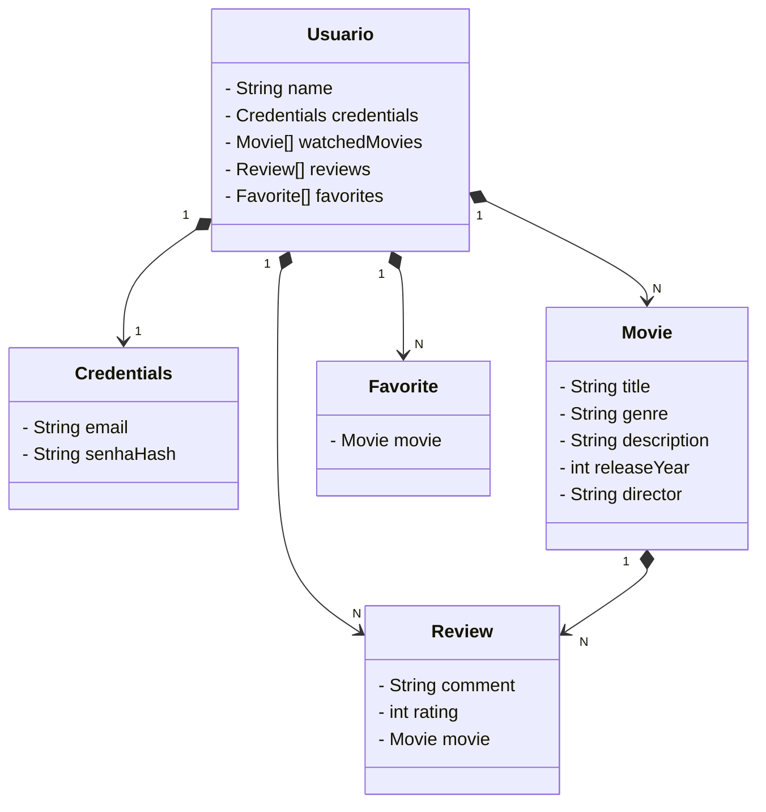

Usuário

O Usuário pode ter filmes assistidos, críticas, e favoritos.
O relacionamento com Credenciais (email e senha) segue a mesma lógica do diagrama anterior.
Filmes

Um Filme tem atributos como título, gênero, descrição, ano de lançamento e diretor.
Críticas

O Usuário pode fazer críticas a filmes, que contêm comentários e classificação (nota de 1 a 5).
Favoritos

O Usuário pode ter uma lista de filmes favoritos.

### Diagrama de classes

